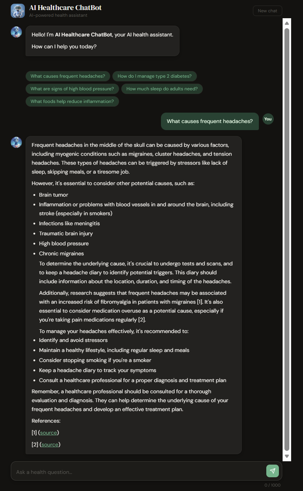

# Healthcare Chatbot — Multi-Agent AI Health Assistant

A production-grade, multi-agent RAG system for medical Q&A built with **LangGraph**, **Groq (LLaMA-3.1-8B)**, **FAISS**, and **live PubMed evidence retrieval**. Evaluated with RAGAS over 50 curated medical Q&A pairs. Vectorstore persisted on **AWS S3**.

## Demo

> Ask any health question — the AI retrieves from 500K+ medical records + live PubMed abstracts and returns a cited answer in under 5 seconds.

